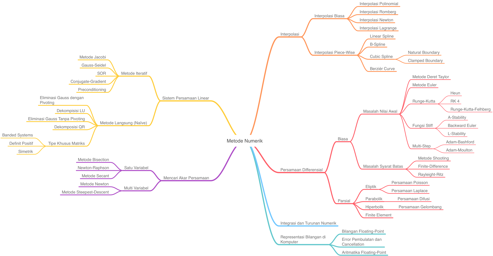

# Metode Numerik

Tidak semua masalah dalam matematika dan sains dapat diselesaikan secara analitik {cite}`inayah_classification_2020`. Sebagian besar permasalahan di dunia nyata ini dapat dibentuk ke dalam persamaan atau model matematika dan diselesaikan dengan cara pendekatan/aproksimasi terhadap solusi analitik atau eksaknya. Walaupun dengan pendekatan ini tidak dapat menghasilkan solusi eksak, akan tetapi biasanya cukup untuk menyelesaikan permasalahan yang ada {cite}`strang_computational_2009`. Disamping itu juga, perlu adanya analisis terhadap error yang timbul karena proses aproksimasi. Hal ini dikarenakan solusi melalui aproksimasi atau disebut solusi numerik memiliki ciri khas yaitu finite (berhingga) dan diskrit {cite}`shiflet_introduction_2014`. 

Metode numerik memfokuskan pada teknik-teknik untuk menyelesaikan berbagai permasalahan matematika secara numerik, menganalisis kekonvergenan dan kestabilan dari tiap-tiap metode yang dipelajari {cite}`anton_elementary_2010`.

Modul ini dilengkapi dengan contoh-contoh kasus di dunia nyata yang diselesaikan menggunakan metode numerik dan diimplementasikan ke dalam bahasa Python {cite}`burden_numerical_2010`.
## Tujuan
Modul ini diharapkan dapat membantu siapa saja untuk menyelesaikan dan menemukan solusi numerik dalam model matematika sederhana, serta dapat menganalisis error dan kekonvergenan dari setiap metode numerik yang dihasilkan dari solusi tersebut, sehingga kita dapat memilih metode mana yang sesuai untuk menyelesaikan masalah-masalah pemodelan matematika sederhana {cite}`boyce_elementary_2020`.

## Materi

1. Representasi Bilangan di Komputer dan Jenis-Jenis Error pada Solusi Numerik
2. Penyelesaian Persamaan Non-Linear Secara Numerik
3. Penyelesaian Sistem Persamaan Linear Secara Numerik
4. Penyelesaian Nilai Eigen dan Vektor Eigen Secara Numerik
5. Interpolasi dan Pencocokan Kurva
6. Turunan Numerik
7. Integrasi secara Numerik
8. Persamaan Differensial Biasa pada Masalah Nilai Awal
9. Persamaan Differensial Biasa pada Masalah Syarat Batas
10. Persmaan Differensial Parsial 
